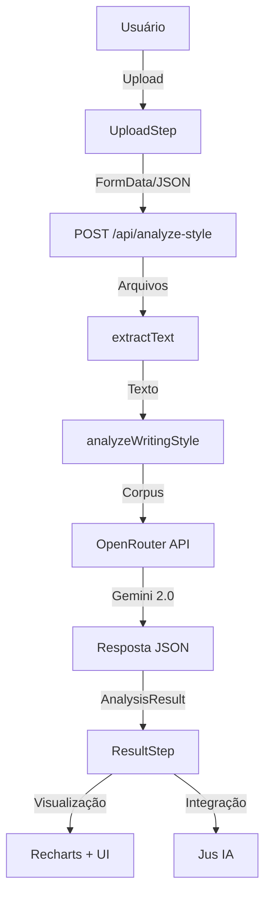

# PRD - Jus IA Style Generator v0.1.0

## 📋 Visão Geral do Produto

### Objetivo
Ferramenta web que analisa documentos jurídicos de advogados e gera um perfil personalizado de estilo de escrita, criando um system prompt otimizado para uso no Jus IA.

### Proposta de Valor
- **Para advogados**: Personalização automática do Jus IA baseada em seu estilo próprio de escrita
- **Para Jus IA**: Geração de respostas mais alinhadas com o estilo pessoal do usuário
- **Diferencial**: Análise profunda usando IA + visualização intuitiva + integração direta

### Status Atual
- **Versão**: 0.1.0
- **Ambiente**: Produção
- **URL**: https://jus-ia-style-gen.vercel.app
- **Repositório**: https://github.com/gabrielvaz/jus-ia-style-gen

---

## 🎯 Funcionalidades Implementadas

### 1. Upload de Documentos
**Status**: ✅ Implementado

**Descrição**: Sistema de upload que aceita documentos jurídicos do usuário.

**Capacidades**:
- Drag-and-drop de arquivos
- Seleção manual via file picker
- Input de texto direto (alternativa ao upload)
- Múltiplos arquivos simultâneos

**Restrições**:
- Mínimo: 1 documento ou texto
- Máximo: 5 documentos
- Formatos aceitos: PDF, DOCX, TXT
- Tamanho máximo: Não limitado explicitamente (limitado pelo Vercel)

**Validações**:
- Tipo de arquivo (MIME type)
- Quantidade de arquivos
- Conteúdo não vazio após extração

### 2. Extração de Texto
**Status**: ✅ Implementado

**Descrição**: Processamento de documentos para extrair conteúdo textual.

**Tecnologias**:
- **PDF**: `pdf-parse` (v2.4.5) com importação dinâmica
- **DOCX**: `mammoth` (v1.11.0)
- **TXT**: Leitura nativa via Buffer

**Fluxo**:
```
Arquivo → Buffer → extractText(buffer, mimeType) → Texto limpo
```

**Formato de Corpus**:
```
--- DOCUMENTO: arquivo1.pdf ---
[texto extraído]

--- DOCUMENTO: arquivo2.docx ---
[texto extraído]
```

### 3. Análise de Estilo via IA
**Status**: ✅ Implementado

**Descrição**: Análise profunda do estilo de escrita usando LLMs via OpenRouter.

**Modelos Utilizados** (com fallback):
1. **Primário**: `google/gemini-2.0-flash-001`
2. **Fallback**: `google/gemini-2.0-flash-lite-preview-02-05:free`

**Parâmetros de Análise**:

| Dimensão | Escala | Descrição |
|----------|--------|-----------|
| Formalidade | 0-100 | Nível de formalidade do texto |
| Complexidade de frases | 0-100 | Estruturas simples vs. complexas |
| Densidade técnica | 0-100 | Uso de terminologia jurídica |
| Uso de citações | 0-100 | Frequência de jurisprudência/doutrina |
| Foco em fatos | 0-100 | Ênfase narrativa factual |
| Foco em fundamentação | 0-100 | Ênfase argumentação legal |

**Timeout**: 60 segundos por tentativa

**Output Estruturado**:
```json
{
  "summary": "Resumo textual do estilo",
  "dimensions": {
    "formalidade": 85,
    "complexidade_frases": 72,
    "densidade_tecnica": 90,
    "uso_citacoes": 78,
    "foco_fatos": 65,
    "foco_fundamentacao": 88
  },
  "bullets": [
    "Observação 1 sobre o estilo",
    "Observação 2 sobre o estilo"
  ],
  "system_prompt": "Prompt completo para Jus IA"
}
```

### 4. Visualização de Perfil
**Status**: ✅ Implementado

**Descrição**: Interface visual para apresentar resultados da análise.

**Componentes**:

#### Bloco 1: Resumo Textual
- Parágrafo descritivo do estilo
- Lista de bullets com observações chave
- Tipografia Inter, tamanhos semânticos

#### Bloco 2: Gráficos
**Biblioteca**: Recharts v3.5.0

**Tipos de visualização**:
- **Radar Chart**: Visão geral das 6 dimensões
- **Bar Chart**: Comparação lado a lado

**Cores**: Seguindo Farol Design System
- Primária: `#007A5F`
- Secundária: `#0052CC`

#### Bloco 3: System Prompt
- Textarea somente leitura
- Botão "Copiar" com feedback visual
- Botão "Testar no Jus IA" (integração direta)

### 5. Integração com Jus IA
**Status**: ✅ Implementado

**Descrição**: Botão que envia o system prompt diretamente para o Jus IA.

**Mecânica**:
```typescript
const url = `https://ia.jusbrasil.com.br/conversa?q=${encodeURIComponent(systemPrompt)}`;
window.open(url, '_blank', 'noopener,noreferrer');
```

**URL Format**:
- Base: `https://ia.jusbrasil.com.br/conversa`
- Query param: `q` (URL-encoded)
- Encoding: UTF-8 com caracteres especiais escapados

**Limitações**:
- URL max length: ~2000 chars (navegadores antigos)
- Prompts típicos: 500-2000 chars
- Avisar usuário se ultrapassar limite

---

## 🏗️ Arquitetura Técnica

### Stack Tecnológico

#### Frontend
```
Next.js 16.0.5 (App Router)
├── React 19.2.0 (com React Compiler)
├── TypeScript 5 (strict mode)
└── Tailwind CSS 4 (@tailwindcss/postcss)
```

#### Backend
```
Next.js API Routes (Edge Runtime)
├── Node.js 20+
├── Axios 1.13.2 (HTTP client)
└── OpenRouter API (LLM provider)
```

#### Bibliotecas Principais
```yaml
Document Processing:
  - pdf-parse: ^2.4.5
  - mammoth: ^1.11.0

Visualização:
  - recharts: ^3.5.0
  - lucide-react: ^0.555.0

Utilities:
  - clsx: ^2.1.1
  - tailwind-merge: ^3.4.0
```

### Estrutura de Diretórios

```
jus-ia-style-gen/
├── src/
│   ├── app/                         # Next.js App Router
│   │   ├── api/
│   │   │   └── analyze-style/
│   │   │       └── route.ts         # Endpoint principal
│   │   ├── analyzing/
│   │   │   └── page.tsx            # Tela de processamento
│   │   ├── create/
│   │   │   └── page.tsx            # Criação de perfil
│   │   ├── profile/
│   │   │   └── page.tsx            # Visualização de perfil
│   │   ├── layout.tsx              # Layout raiz
│   │   ├── page.tsx                # Página principal (wizard)
│   │   └── globals.css             # Estilos + design tokens
│   │
│   ├── components/
│   │   ├── steps/
│   │   │   ├── LandingStep.tsx     # Tela inicial
│   │   │   ├── UploadStep.tsx      # Upload de arquivos
│   │   │   ├── ProcessingStep.tsx  # Loading/progresso
│   │   │   └── ResultStep.tsx      # Exibição de resultados
│   │   ├── ui/
│   │   │   ├── Button.tsx
│   │   │   ├── Card.tsx
│   │   │   ├── Input.tsx
│   │   │   ├── ProgressBar.tsx
│   │   │   └── FileUpload.tsx
│   │   └── JusIALogo.tsx           # Logo oficial
│   │
│   ├── lib/
│   │   ├── openrouter.ts           # Cliente OpenRouter
│   │   ├── text-extractor.ts       # Extração de texto
│   │   └── utils.ts                # Utilitários gerais
│   │
│   └── context/
│       └── AnalysisContext.tsx     # Estado global (se usado)
│
├── public/                          # Arquivos estáticos
├── .env.local                       # Variáveis de ambiente (gitignored)
├── .env.example                     # Template de variáveis
├── vercel.json                      # Configuração Vercel
├── next.config.ts                   # Configuração Next.js
├── tailwind.config.ts               # Configuração Tailwind
└── tsconfig.json                    # Configuração TypeScript
```

### Fluxo de Dados



---

## 🎨 Design System (Farol)

### Paleta de Cores

```css
/* Cores principais */
--color-primary: #007A5F;           /* Verde Farol */
--color-primary-50: #E6F4EF;        /* Fundo leve */
--color-secondary: #0052CC;         /* Azul links */

/* Neutros */
--color-neutral-900: #1D1D1D;       /* Texto forte */
--color-neutral-700: #4A4A4A;       /* Texto padrão */
--color-neutral-500: #8A8A8A;       /* Texto secundário */
--color-neutral-200: #E5E5E5;       /* Bordas */
--color-neutral-50: #FAFAFA;        /* Fundo neutro */

/* Estados */
--color-error: #D93025;             /* Erros */
--color-success: #34A853;           /* Sucesso */
```

### Tipografia

**Fonte**: Inter (via `next/font/google`)

**Escalas**:
```css
Display/H1: 32px / semibold / line-height 1.2
H2:         24px / semibold / line-height 1.3
H3:         20px / medium   / line-height 1.4
Body:       16px / regular  / line-height 1.5
Small:      14px / regular  / line-height 1.5
Caption:    12px / regular  / line-height 1.4
```

### Espaçamento (Sistema 8pt)

```css
--spacing-tight: 4px;
--spacing-xs: 8px;
--spacing-sm: 16px;
--spacing-md: 24px;
--spacing-lg: 32px;
--spacing-xl: 40px;
--spacing-xxl: 64px;
```

### Componentes Base

#### Botões
```css
Primário:
  - Background: var(--color-primary)
  - Texto: white
  - Border-radius: 8px
  - Padding: 12px 20px
  - Hover: darken 8%

Secundário:
  - Background: white
  - Border: 1px solid var(--color-neutral-200)
  - Texto: var(--color-neutral-900)
  - Hover: background var(--color-neutral-50)
```

#### Inputs
```css
- Height: 44px
- Padding: 12px
- Border: 1px solid var(--color-neutral-200)
- Border-radius: 8px
- Focus: border var(--color-primary)
```

#### Cards
```css
- Background: white
- Border-radius: 12px
- Border: 1px solid var(--color-neutral-200)
- Box-shadow: 0 1px 3px rgba(0,0,0,0.08)
- Padding: 16px - 24px
```

### Responsividade

**Breakpoints**:
- Mobile: 480px
- Tablet: 768px
- Desktop: 1024px
- Large: 1440px

**Estratégia**: Mobile-first

---

## 🔌 API Specification

### POST `/api/analyze-style`

Endpoint principal para análise de documentos.

#### Request

**Content-Type**: `multipart/form-data` ou `application/json`

**Opção 1: Upload de arquivos**
```
POST /api/analyze-style
Content-Type: multipart/form-data

files: File[] (1-5 arquivos)
```

**Opção 2: Texto direto**
```json
POST /api/analyze-style
Content-Type: application/json

{
  "text": "Texto para análise..."
}
```

#### Response

**Status 200**: Sucesso
```json
{
  "summary": "Resumo do estilo de escrita...",
  "dimensions": {
    "formalidade": 85,
    "complexidade_frases": 72,
    "densidade_tecnica": 90,
    "uso_citacoes": 78,
    "foco_fatos": 65,
    "foco_fundamentacao": 88
  },
  "bullets": [
    "Tom altamente formal e técnico",
    "Uso frequente de citações jurisprudenciais",
    "Estrutura em três partes: fatos, fundamentação, pedidos"
  ],
  "system_prompt": "Você é um assistente jurídico especializado..."
}
```

**Status 400**: Erro de validação
```json
{
  "error": "No files uploaded"
}
```

**Status 500**: Erro interno
```json
{
  "error": "Internal server error",
  "details": "OPENROUTER_API_KEY is not configured"
}
```

#### Processamento

1. **Validação**: Tipo de conteúdo, número de arquivos
2. **Extração**: Texto de cada documento
3. **Concatenação**: Corpus único com separadores
4. **Análise**: Chamada ao OpenRouter (Gemini)
5. **Parse**: JSON estruturado
6. **Retorno**: AnalysisResult

---

## 🤖 Integração com IA

### Provider: OpenRouter

**URL Base**: `https://openrouter.ai/api/v1/chat/completions`

**Autenticação**: Bearer token via `OPENROUTER_API_KEY`

### Modelos Configurados

#### Modelo Primário
```yaml
ID: google/gemini-2.0-flash-001
Provider: Google
Tipo: Flash (rápido)
Custo: Pago (mas acessível)
Context Window: Grande
JSON Mode: Suportado
```

#### Modelo Fallback
```yaml
ID: google/gemini-2.0-flash-lite-preview-02-05:free
Provider: Google
Tipo: Flash Lite
Custo: Gratuito
Context Window: Médio
JSON Mode: Suportado
```

### Estratégia de Fallback

```typescript
for (const model of MODELS) {
  try {
    // Tentar análise com modelo atual
    return await callOpenRouter(model, corpus);
  } catch (error) {
    // Log do erro
    // Continuar para próximo modelo
  }
}
// Se todos falharem, throw error
```

### Prompt Engineering

**Estrutura do Prompt**:
```
Você é um especialista em análise linguística e jurídica.

Corpus:
[texto concatenado]

Instruções:
1. Analise: tom, vocabulário, estrutura, citações, formalidade
2. Gere resumo textual
3. Avalie dimensões 0-100
4. Liste bullets práticos
5. Crie SYSTEM PROMPT completo

Retorne APENAS JSON válido:
{ schema definido }
```

**Configurações**:
```json
{
  "model": "google/gemini-2.0-flash-001",
  "messages": [...],
  "response_format": { "type": "json_object" },
  "timeout": 60000
}
```

**Headers**:
```json
{
  "Authorization": "Bearer sk-or-v1-...",
  "Content-Type": "application/json",
  "HTTP-Referer": "https://jus-ia-style-gen.vercel.app",
  "X-Title": "Jus IA Style Gen"
}
```

---

## 🚀 Deploy & Infraestrutura

### Plataforma: Vercel

**Projeto**: `jus-ia-writing-style-profile-gen`
**Organização**: `gabrielvazs-projects`
**Região**: São Paulo (gru1)

### Configuração (vercel.json)

```json
{
  "buildCommand": "npm run build",
  "devCommand": "npm run dev",
  "installCommand": "npm install",
  "framework": "nextjs",
  "regions": ["gru1"]
}
```

### Variáveis de Ambiente

#### Produção
```bash
OPENROUTER_API_KEY=sk-or-v1-... (Production, Preview, Development)
```

**Configuração**:
```typescript
// next.config.ts
env: {
  OPENROUTER_API_KEY: process.env.OPENROUTER_API_KEY,
}
```

### Build

**Comando**: `npm run build`
**Tempo médio**: 24-40s (com cache)
**Output**: `.next/` directory

**Rotas geradas**:
- `○ /` - Static
- `○ /analyzing` - Static
- `○ /create` - Static
- `○ /profile` - Static
- `ƒ /api/analyze-style` - Dynamic (serverless function)

### CI/CD

**Trigger**: Push para `main`
**Flow**:
```
git push → GitHub → Vercel (auto-deploy)
         ↓
    Build → Test → Deploy → Production
```

**Preview Deployments**: Pull Requests automático

---

## 📊 Fluxo de Usuário

### Tela 1: Landing

**Rota**: `/`
**Componente**: `LandingStep`

**Elementos**:
- Logo Jus IA (SVG oficial)
- Título: "Faça o Jus IA escrever com o seu estilo"
- Subtítulo explicativo
- 3 bullets de valor
- CTA: "Começar" → UploadStep

### Tela 2: Upload

**Rota**: `/` (wizard state)
**Componente**: `UploadStep`

**Elementos**:
- Título: "Envie seus documentos"
- Instruções
- Área de drag-and-drop
- File picker
- **Alternativa**: Input de texto direto
- Lista de arquivos selecionados
- Botão: "Analisar estilo de escrita"

**Validações**:
- 0 arquivos → botão desabilitado
- >5 arquivos → erro
- Tipos inválidos → erro

### Tela 3: Processing

**Rota**: `/analyzing` ou wizard state
**Componente**: `ProcessingStep`

**Elementos**:
- Título: "Analisando seu estilo"
- Subtítulo: "Nossa IA está processando..."
- Progress indicator (20%, 40%, etc.)
- Lista de etapas:
  - ✓ Lendo seus documentos...
  - ⏳ Identificando padrão de vocabulário...
  - ⏳ Analisando tom e formalidade...
  - ⏳ Estruturando perfil de estilo...
  - ⏳ Gerando system prompt...

### Tela 4: Results

**Rota**: `/profile` ou wizard state
**Componente**: `ResultStep`

**Seções**:

#### 1. Resumo Textual
- Título: "Resumo do seu estilo de escrita"
- Parágrafo: `{analysis.summary}`
- Bullets: `{analysis.bullets[]}`

#### 2. Visualização
- Título: "Visualização do seu perfil"
- Radar Chart (6 dimensões)
- Bar Chart alternativo
- Legenda de cores

#### 3. System Prompt
- Título: "Prompt de sistema para o Jus IA"
- Textarea somente leitura
- Botão "Copiar prompt"
- Botão "Testar no Jus IA" (primary)

**Ações**:
- "Nova análise" → volta para Landing

---

## 🔒 Segurança & Compliance

### Dados do Usuário

**Armazenamento**: Nenhum
- Documentos processados em memória
- Não há banco de dados
- Não há persistência de dados
- Session-only (frontend state)

**Privacidade**:
- Documentos não são salvos
- Corpus enviado apenas ao OpenRouter
- Sem tracking de usuário
- Sem cookies de terceiros

### API Keys

**Proteção**:
- Variável de ambiente (não commitada)
- Acesso apenas server-side
- Não exposta ao cliente
- Rotação manual

**Validação**:
```typescript
if (!OPENROUTER_API_KEY) {
  throw new Error("OPENROUTER_API_KEY is not configured");
}
```

### CORS & Headers

**Configuração automática** via Next.js
**Headers de segurança**:
- `noopener,noreferrer` em links externos
- Content-Type validation
- Request size limits (Vercel padrão)

---

## 📈 Métricas & Monitoramento

### Vercel Analytics

**Habilitado**: Sim (automático)

**Métricas disponíveis**:
- Page views
- Unique visitors
- Top pages
- Top referrers
- Device breakdown

### Core Web Vitals

**Monitoramento**: Vercel Speed Insights

**Métricas**:
- LCP (Largest Contentful Paint)
- FID (First Input Delay)
- CLS (Cumulative Layout Shift)

### Logs

**Localização**: Vercel Dashboard
**Acesso**: `vercel logs [deployment-url]`

**Debug atual**:
```typescript
console.log('[API] OPENROUTER_API_KEY exists:', !!process.env.OPENROUTER_API_KEY);
console.log('[Server] Attempting analysis with model:', model);
```

---

## 🐛 Issues Conhecidos

### 1. Importação pdf-parse
**Problema**: Incompatibilidade ESM/CommonJS no Turbopack
**Solução**: Importação dinâmica
```typescript
const pdfParse = (await import("pdf-parse")).default;
```
**Status**: ✅ Resolvido

### 2. Canvas polyfill warnings
**Problema**: `@napi-rs/canvas` não encontrado durante build
**Impacto**: Avisos no log, mas não afeta funcionalidade
**Ação**: Nenhuma necessária (opcional para renderização)

### 3. Variável de ambiente no Vercel
**Problema**: `OPENROUTER_API_KEY is not configured` em produção
**Tentativas**:
- Variável adicionada em Production, Preview, Development
- Configuração explícita no `next.config.ts`
- Debug logging adicionado
**Status**: 🔄 Em investigação

---

## 🔮 Roadmap Futuro

### v0.2.0 (Próxima versão)
- [ ] Correção definitiva da variável de ambiente
- [ ] Remoção de debug logs
- [ ] Otimização de performance
- [ ] Testes end-to-end

### v0.3.0 (Features)
- [ ] Histórico de análises (localStorage)
- [ ] Comparação entre perfis
- [ ] Export de relatório em PDF
- [ ] Mais formatos de documento (ODT, RTF)

### v0.4.0 (Avançado)
- [ ] Autenticação de usuários
- [ ] Banco de dados (perfis persistentes)
- [ ] Dashboard com métricas
- [ ] API pública
- [ ] Análise incremental (adicionar docs)

### v1.0.0 (Produção)
- [ ] Integração oficial no Jus IA
- [ ] Testes automatizados completos
- [ ] Documentação de API
- [ ] Rate limiting
- [ ] Monitoramento avançado

---

## 📚 Documentação Relacionada

### Arquivos do Projeto
- `README.md` - Documentação principal
- `CHANGELOG.md` - Histórico de versões
- `DEPLOY.md` - Guia de deployment
- `CLAUDE.md` - Guia para Claude Code
- `JUS_IA_INTEGRATION.md` - Integração técnica
- `url-jus-ia.md` - Especificação de URL
- `specs.md` - Especificações originais (v1)

### Links Externos
- [Next.js Docs](https://nextjs.org/docs)
- [Vercel Docs](https://vercel.com/docs)
- [OpenRouter Docs](https://openrouter.ai/docs)
- [Tailwind CSS v4](https://tailwindcss.com/docs)
- [Recharts](https://recharts.org/en-US)

---

## 👥 Stakeholders

### Desenvolvimento
- **Lead**: Gabriel Vaz ([@gabrielvaz](https://github.com/gabrielvaz))
- **IA Assistant**: Claude Code

### Negócio
- **Produto**: Jus IA / Jusbrasil
- **Usuários-alvo**: Advogados brasileiros

---

## 📝 Notas Técnicas

### TypeScript
**Configuração**: Strict mode
```json
{
  "strict": true,
  "target": "ES2017",
  "lib": ["dom", "dom.iterable", "esnext"]
}
```

### React Compiler
**Status**: Habilitado
```typescript
reactCompiler: true
```
**Benefício**: Otimizações automáticas de re-renderização

### ESLint
**Configuração**: `eslint-config-next`
**Comando**: `npm run lint`

### Tailwind CSS v4
**Novidade**: Usa `@theme` directive
**PostCSS**: `@tailwindcss/postcss`

---

## 🎯 KPIs (Sugeridos)

### Técnicos
- Build time: < 40s
- Page load time: < 2s
- API response time: < 10s
- Uptime: > 99.9%

### Produto
- Uploads por dia
- Taxa de sucesso de análise: > 95%
- Taxa de uso do botão "Testar no Jus IA"
- NPS / Satisfação

---

## 📞 Suporte

### Issues
GitHub Issues: https://github.com/gabrielvaz/jus-ia-style-gen/issues

### Email
(a definir)

### Status Page
Vercel Status: https://www.vercel-status.com/

---

**Última atualização**: 2025-01-28
**Versão do documento**: 2.0
**Status do produto**: ✅ Em produção com issues conhecidos
